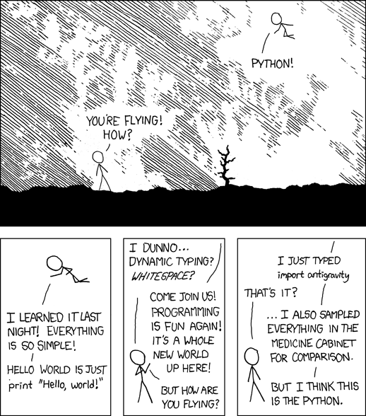
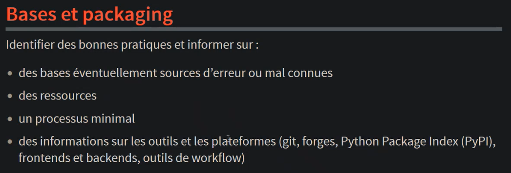

# Sondage

> * Qui a déjà utilisé uv ?
> * Qui pense que l'outillage en Python c'est le bazar ?

# L'écosystème Python

## Une force

## Une faiblesse

## À la recherche des bonnes pratiques

## Différents besoins

![Anna-Lena Popkes - unbiased evaluation of [...] tools](venn_diagram_updated_08_2024.png) { style="height: 700;" }

## Le risque de l'Open-Source

## L'hétérogénéité

# Astral

## La productivité, pour Python

## Ruff, un linter pour les gouverner tous

 { style="height: 700px;" }

## les bonnes personnes, et l'argent

> * RipGrep
> * Bat
> * Hyperfine
> * Maturin
> * CPython core dev
> * ...
> * "VC money"

# uv

## "Cargo pour python"

## Repartir sur de bonnes bases

> * `pyproject.toml` (pas de `.py` ni `.cfg` ni `.txt` ...)
> * PEPs : adopter voire contribuer
> * intégrations : Docker, Jupyter, pre-commit, GitHub Actions, Gitlab CI/CD, ...
> * [python-build-standalone](https://github.com/indygreg/python-build-standalone)
> * pas besoin de bootstrap grâce à Rust

## Mise en place

> 1. `requirements.txt`
> 2. `pyproject.toml` (Poetry, ...)
> 3. `uv`

. . .

ou bien : `uv init` + `uv add`

# Success stories

> * "l'essayer c'est l'adopter"
> * vitesse (exécution, résolution des dépendances, réduction des downloads, caching, ...)
> * ergonomie (options, erreurs claires)
> * automatisation de l'environnement virtual (peu de commandes, reproductif et déclaratif)
> * gestion facile et rapide de la version de Python
> * gestion du tooling (`uv tool ...`)
> * lock file (reproductibilité dans le temps ou entre les personnes)
> * bien meilleur que les autres, et s'améliore encore 😅

# { .blank data-background-image="theme/image_page_de_fin_kaizen.jpg" }

::: { .contact }

Julien Lenormand

Dev / DevOps / Craft / Talk

LinkedIn/julien-lenormand

:::

# Questions { .blank data-background-image="simon-hurry-DxC7IwXQkxI-unsplash.jpg" }

> ?

# Bonus : vélocité

# CFP

Vous faites du Python et vous ne connaissez pas encore UV ? Ce talk est fait pour vous !

Vous ne faites principalement pas du Python mais ça vous arrive d'en croiser ? Ce talk est fait pour vous !

Vous trouvez que Python c'est naze, et vous ne voulez pas y toucher même avec un bâton ? Ce talk est fait pour vous !

En quelques mois, uv a révolutionné la façon d'utiliser Python, tout simplement. Et ça concerne tout le monde : Python est présent partout.

Venez découvrir ce que c'est, pour quoi faire, pourquoi, par qui, comment, vers quoi, vers où.

Promis, je serai ~~im~~partial !
