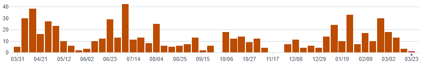
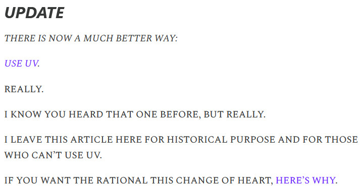

# uv : la révolution pour Python

# UV : rayonnez avec la nouvelle puissance de Python


---

# Ecosystème Python fracturé et fragile (et lent)


---

![Anna-Lena Popkes - unbiased evaluation of [...] tools](venn_diagram_updated_08_2024.png)

---

## A la recherche des bonnes pratiques

Françoise Conil - Recherche des bonnes pratiques de packaging
* [replay sur IndyMotion](https://indymotion.fr/w/r1L6xCLymfYC9BBxqVJ6Ze)
* [slides](https://perso.liris.cnrs.fr/francoise.conil/recherche-des-bonnes-pratiques-de-packaging/#/title-slide)

Conclusions :
* bien comprendre les primitives
* ne pas confondre le problème avec la solutions
* attention aux détails d'implémentation

---

# Astral

objectif : productivité en Python (cf Cargo)


---

## Ruff


---

## La recette du succès

* des gens compétents (expérience, connus de la communauté ...)
* salariés
* nombreux (12+)
* n'ont "rien" inventé

---

## Risques

* VC
* Rust
* [licencing](https://docs.astral.sh/uv/reference/policies/license/) (dual MIT + Apache2)
* 

---

Poetry 

PDM 

Pip 

Pipenv 

uv 

---

# uv

tout part de rye

puis pip

et enfin uv

---


---

## Repartir sur de bonnes bases

> * `pyproject.toml` (pas de `.py` ni `.cfg` ni `.txt` ...)
> * PEPs : adopter voire contribuer
> * intégrations : Docker, Jupyter, pre-commit, GitHub Actions, Gitlab CI/CD, ...
> * [python-build-standalone](https://github.com/indygreg/python-build-standalone) : télécharger et ça marche
> * pas besoin de bootstrap grâce à Rust
> * *second-mover advantage* / *standing on the shoulders of giants*
> * commandes de haut niveau, orientées résultat

---

## Résoudre les problèmes difficiles

* localiser le bon interpréteur
* identifier quelles sont les dépendances (primaires) requises
* savoir quelles sont toutes les dépendances (transitives) requises
* sans support multi-version d'un même package par Python
* avec une [syntaxe compliquée pour les versions](https://packaging.python.org/en/latest/specifications/version-specifiers/)
* à travers tous les environnements possibles (version de Python, archi matérielle, ...)
* dont les métadonnées des packages peuvent être manquantes

---

## Comment ils ont fait ?

* des tests
* du tooling de test
  * (packaging scenarios : https://github.com/astral-sh/packse)
* Rust
  * outils Rust ([pubgrub](https://crates.io/crates/pubgrub))

---

## Performance

* Rust
* Rust low-level optimisation (memory layouts)
* network optimisation (ZIP reading, ...)
* caching
* hardlinking
* ...
* cf seconde moitié du talk chez Jane Street : https://www.youtube.com/watch?v=gSKTfG1GXYQ

---

## Success stories

* "l'essayer c'est l'adopter"
* vitesse (exécution, résolution des dépendances, réduction des downloads, caching, ...)
* ergonomie (options, erreurs claires)
* automatisation de l'environnement virtuel (peu de commandes, reproductif et déclaratif)
* gestion facile et rapide de la version de Python
* gestion du tooling (`uv tool ...`)
* lock file (reproductibilité dans le temps ou entre les personnes)
* bien meilleur que les autres, et s'améliore encore 😅
* `git clone` puis `uv run` et ça marche !
* vient clé en main avec tout l'outillage qu'il faut

---

Même BiteCode !

[Relieving your Python packaging pain](https://www.bitecode.dev/p/relieving-your-python-packaging-pain)

Avant :

> 1. Don’t install the latest major version of Python
> 2. Use only the python.org installer on Windows and Mac, or official repositories on Linux.
> 3. Never install or run anything outside of a virtual environment
> 4. Limit yourself to the basics: “pip” and “venv”
> 5. If you run a command, use “-m”
> 6. When creating a virtual environment, be explicit about which Python you use

---

Après :



[A year of uv: pros, cons, and should you migrate](https://www.bitecode.dev/p/a-year-of-uv-pros-cons-and-should)

---

## Concepts

**DEMO** !!!

* `pyproject.toml` : dépendances primaires
* `uv.lock` : dépendances transitives + résolution
* `.venv` : automatiquement peuplé
* activation du `venv` : automatique

Commandes : `init` --> `add` --> (`lock` + `venv` + `sync`) --> `run`

---

# Migration

* [installation](https://docs.astral.sh/uv/getting-started/installation/) : curl, PyPI, Cargo, Homebrew, WinGet, Docker, ...
* `pyproject.toml` :
  * https://github.com/stvnksslr/uv-migrator
  * https://github.com/mkniewallner/migrate-to-uv
* `uv tool run migrate-to-uv` 😋

---

Avant (Pip `requirements.txt`) :
```
toto ~= 1.2.3
--extra-index-url https://example.com/simple
titi == 4.5.6
```

Situation :
* la convention est que les indexes doivent avoir un contenu identique
* or, j'ai des sources hétérogènes (PyPI public, registries internes, ...)

Problème :
* les install échouent souvent car Pip cherche sur le "mauvais" index
* vulnérable à des attaques de supply chain : ([exemple de *dependency confusion*](https://medium.com/@alex.birsan/dependency-confusion-4a5d60fec610))

Solution :
* ???
* avoir des fichiers séparés, les installés séparément, prier pour qu'il n'y ait pas de conflits

---

Avant (Poetry `pyproject.toml`) :
```toml
[tool.poetry.dependencies]
python = "~3.12"
toto = {version = "^1.2.3", source = "pypi"}
titi = {version = "4.5.6", source = "artifactory"}

[[tool.poetry.source]]
name = "pypi"
# url is omitted for PyPI
priority = "primary"

[[tool.poetry.source]]
name = "artifactory"
url = "https://example.com/simple"
priority = "explicit"
```

+ credentials dans `~/.config/pypoetry/auth.toml` ou [`keyring`](https://pypi.org/project/keyring/)

---

Après (uv `pyproject.toml`):
```toml
[project]
dependencies = [
    "toto ~= 1.2.3",
    "titi == 4.5.6",
]

[tool.uv.sources]
titi = { index = "artifactory" }

[[tool.uv.index]]
name = "artifactory"
url = "https://example.com/simple/"
```

+ variables d'environnement `UV_INDEX_ARTIFACTORY_USERNAME=...` + `UV_INDEX_ARTIFACTORY_PASSWORD=...` ou bien `--keyring-provider subprocess`

---

## Integrations : CI

```yaml
linting:
  image: ghcr.io/astral-sh/uv:debian-slim
  script:
    - uv run ruff check .
    - uv run mypy .
```

* [Using uv in GitLab CI/CD](https://docs.astral.sh/uv/guides/integration/gitlab/)
* [Using uv in GitHub Actions](https://docs.astral.sh/uv/guides/integration/github/)

---

## Intégration : private registry

* [Using alternative package indexes](https://docs.astral.sh/uv/guides/integration/alternative-indexes/) :
  * Azure Artifacts
  * Google Artifact Registry
  * AWS CodeArtifact
  * JFrog's Artifactory
  * GitLab registry
  * ... (PEP standards, différences/limitations)

---

## Intégration : Docker

```Dockefile
FROM python:3.12-slim-bookworm
COPY --from=ghcr.io/astral-sh/uv:latest /uv /uvx /bin/
WORKDIR /app
COPY pyproject.toml uv.lock  /app/
COPY src/  /app/src/
RUN uv sync --frozen --no-dev --compile-bytecode
ENTRYPOINT ["uv", "run", "--frozen", "--no-sync", "python", "-m", "my_app"]
```

Sur [ghcr.io](https://github.com/astral-sh/uv/pkgs/container/uv) : `alpine:3.20`, `debian:bookworm-slim`, `buildpack-deps:bookworm`, `python3.x-alpine`, `python3.x-bookworm`, `python3.x-slim-bookworm`

[Using uv in Docker](https://docs.astral.sh/uv/guides/integration/docker/)

---

# Commandes

---

## uv pip

"low-level plumbing" (comme pour git)

---

## uv venv

presque un détail d'implémentation

une contrainte de l'environnement (et de la conception) de Python

---

## uv run

fait tout pour moi :
* python bootstrap
* lock
* venv creation + sync

---

* `--script` pour les [scripts (PEP 723)](https://docs.astral.sh/uv/guides/scripts/)
  ```python
  # /// script
  # dependencies = [
  #   "requests<3",
  #   "rich",
  # ]
  # ///
  
  import requests
  from rich.pretty import pprint
  ```
* `--with ...` qui permet de faire la même chose manuellement :

  `uv run --script --with requests --with rich ...`

  ```python
  import requests
  from rich.pretty import pprint
  ```

---

shell shebang trick (Linux only) :

`#!/usr/bin/env -S uv run --script`

`/usr/bin/env '-S uv run --script' foo.py`

---

## uv tool run

`uvx` pour les intimes

marche pour tout package Python qui déclare des *entrypoints* :

`uv tool run ruff check .`

et on peut mettre ce qu'on veut avec des `with` :

`uv tool run --with requests python -c 'import requests; print(requests)'`

---

## uv tool

* run
* install / uninstall
* upgrade
* list
* update-shell / dir (--bin)

---

## uv init

* app / lib
* vcs
* bare
* author-from
* name
* build-backend
* python version

---

## Dependency group

```
[dependency-groups]
dev = [
    "ruff ~= 0.9.0",
    "mypy ~= 1.14",
    "pytest ~= 8.0",
    "pytest-freezer ~= 0.4.9",
    "coverage ~= 7.6"
]
```

---

## Workspaces

Tout un monde dont Brieuc vous parlera bientôt !

---

## Solving dependencies

```
$ uv tool run --with 'mypy_extensions<0.2.0' black  # black==25.1.0 requires mypy_extensions>=0.4.3
  × No solution found when resolving tool dependencies:
  ╰─▶ Because all versions of black depend on mypy-extensions>=0.4.3 and you require black, we can conclude that you require mypy-extensions>=0.4.3.
      And because you require mypy-extensions<0.2.0, we can conclude that your requirements are unsatisfiable.
```

---

## uv tree

```
$ uv tree
Resolved 90 packages in 4ms
orchestrator v1.5.0
├── aiohttp v3.11.11
│   ├── aiohappyeyeballs v2.4.4
│   ├── aiosignal v1.3.2
│   │   └── frozenlist v1.5.0
│   ├── attrs v24.3.0
│   ├── frozenlist v1.5.0
│   ├── multidict v6.1.0
│   ├── propcache v0.2.1
│   └── yarl v1.18.3
│       ├── idna v3.10
│       ├── multidict v6.1.0
│       └── propcache v0.2.1
├── apscheduler v3.11.0
│   └── tzlocal v5.2
├── fastapi[standard] v0.115.6
│   ├── pydantic v2.10.3
│   │   ├── annotated-types v0.7.0
│   │   ├── pydantic-core v2.27.1
│   │   │   └── typing-extensions v4.12.2
│   │   └── typing-extensions v4.12.2
│   ├── starlette v0.41.3
│   │   └── anyio v4.7.0
│   │       ├── idna v3.10
│   │       └── sniffio v1.3.1
│   ├── typing-extensions v4.12.2
│   ├── email-validator v2.2.0 (extra: standard)
│   │   ├── dnspython v2.7.0
│   │   └── idna v3.10
│   ├── fastapi-cli[standard] v0.0.5 (extra: standard)
│   │   ├── typer v0.15.1
│   │   │   ├── click v8.1.8
│   │   │   ├── rich v12.6.0
│   │   │   │   ├── commonmark v0.9.1
│   │   │   │   └── pygments v2.18.0
│   │   │   ├── shellingham v1.5.4
│   │   │   └── typing-extensions v4.12.2
│   │   ├── uvicorn[standard] v0.34.0
│   │   │   ├── click v8.1.8
│   │   │   ├── h11 v0.14.0
│   │   │   ├── httptools v0.6.4 (extra: standard)
│   │   │   ├── python-dotenv v1.0.1 (extra: standard)
│   │   │   ├── pyyaml v6.0.2 (extra: standard)
│   │   │   ├── uvloop v0.21.0 (extra: standard)
│   │   │   ├── watchfiles v1.0.4 (extra: standard)
│   │   │   │   └── anyio v4.7.0 (*)
│   │   │   └── websockets v14.1 (extra: standard)
│   │   └── uvicorn[standard] v0.34.0 (extra: standard) (*)
│   ├── httpx v0.28.1 (extra: standard)
│   │   ├── anyio v4.7.0 (*)
│   │   ├── certifi v2024.12.14
│   │   ├── httpcore v1.0.7
│   │   │   ├── certifi v2024.12.14
│   │   │   └── h11 v0.14.0
│   │   └── idna v3.10
│   ├── jinja2 v3.1.5 (extra: standard)
│   │   └── markupsafe v3.0.2
│   ├── python-multipart v0.0.20 (extra: standard)
│   └── uvicorn[standard] v0.34.0 (extra: standard) (*)
├── prometheus-fastapi-instrumentator v7.0.2
│   ├── prometheus-client v0.21.1
│   └── starlette v0.41.3 (*)
├── pydantic-settings v2.7.0
│   ├── pydantic v2.10.3 (*)
│   └── python-dotenv v1.0.1
├── xraydigital v2.3.0
│   ├── rich v12.6.0 (*)
│   └── structlog v22.3.0
├── coverage v7.6.10 (group: dev)
├── mypy v1.14.1 (group: dev)
│   ├── mypy-extensions v1.0.0
│   └── typing-extensions v4.12.2
├── pytest v8.3.4 (group: dev)
│   ├── iniconfig v2.0.0
│   ├── packaging v24.2
│   └── pluggy v1.5.0
├── pytest-freezer v0.4.9 (group: dev)
│   ├── freezegun v1.5.1
│   │   └── python-dateutil v2.9.0.post0
│   │       └── six v1.17.0
│   └── pytest v8.3.4 (*)
└── ruff v0.9.1 (group: dev)
(*) Package tree already displayed
```

---

```
$ uv tree --outdated --universal
Resolved 88 packages in 19ms
orchestrator v1.5.0
├── aiohttp v3.11.11 (latest: v3.11.14)
│   ├── aiohappyeyeballs v2.4.4 (latest: v2.6.1)
│   ├── aiosignal v1.3.2
│   │   └── frozenlist v1.5.0
│   ├── attrs v24.3.0 (latest: v25.3.0)
│   ├── frozenlist v1.5.0
│   ├── multidict v6.1.0 (latest: v6.2.0)
│   ├── propcache v0.2.1 (latest: v0.3.0)
│   └── yarl v1.18.3
│       ├── idna v3.10
│       ├── multidict v6.1.0
│       └── propcache v0.2.1
├── apscheduler v3.11.0
│   └── tzlocal v5.2 (latest: v5.3.1)
│       └── tzdata v2024.2 (latest: v2025.2)
├── fastapi[standard] v0.115.6 (latest: v0.115.12)
│   ├── pydantic v2.10.3 (latest: v2.10.6)
│   │   ├── annotated-types v0.7.0
│   │   ├── pydantic-core v2.27.1 (latest: v2.32.0)
│   │   │   └── typing-extensions v4.12.2
│   │   └── typing-extensions v4.12.2
│   ├── starlette v0.41.3 (latest: v0.46.1)
│   │   └── anyio v4.7.0 (latest: v4.9.0)
│   │       ├── idna v3.10
│   │       ├── sniffio v1.3.1
│   │       └── typing-extensions v4.12.2
│   ├── typing-extensions v4.12.2
│   ├── email-validator v2.2.0 (extra: standard)
│   │   ├── dnspython v2.7.0
│   │   └── idna v3.10
│   ├── fastapi-cli[standard] v0.0.5 (extra: standard) (latest: v0.0.7)
│   │   ├── typer v0.15.1 (latest: v0.15.2)
│   │   │   ├── click v8.1.8
│   │   │   │   └── colorama v0.4.6
│   │   │   ├── rich v12.6.0 (latest: v13.9.4)
│   │   │   │   ├── commonmark v0.9.1
│   │   │   │   └── pygments v2.18.0 (latest: v2.19.1)
│   │   │   ├── shellingham v1.5.4
│   │   │   └── typing-extensions v4.12.2
│   │   ├── uvicorn[standard] v0.34.0
│   │   │   ├── click v8.1.8 (*)
│   │   │   ├── h11 v0.14.0
│   │   │   ├── colorama v0.4.6 (extra: standard)
│   │   │   ├── httptools v0.6.4 (extra: standard)
│   │   │   ├── python-dotenv v1.0.1 (extra: standard)
│   │   │   ├── pyyaml v6.0.2 (extra: standard)
│   │   │   ├── uvloop v0.21.0 (extra: standard)
│   │   │   ├── watchfiles v1.0.4 (extra: standard)
│   │   │   │   └── anyio v4.7.0 (*)
│   │   │   └── websockets v14.1 (extra: standard) (latest: v15.0.1)
│   │   └── uvicorn[standard] v0.34.0 (extra: standard) (*)
│   ├── httpx v0.28.1 (extra: standard)
│   │   ├── anyio v4.7.0 (*)
│   │   ├── certifi v2024.12.14 (latest: v2025.1.31)
│   │   ├── httpcore v1.0.7
│   │   │   ├── certifi v2024.12.14
│   │   │   └── h11 v0.14.0
│   │   └── idna v3.10
│   ├── jinja2 v3.1.5 (extra: standard) (latest: v3.1.6)
│   │   └── markupsafe v3.0.2
│   ├── python-multipart v0.0.20 (extra: standard)
│   └── uvicorn[standard] v0.34.0 (extra: standard) (*)
├── prometheus-fastapi-instrumentator v7.0.2 (latest: v7.1.0)
│   ├── prometheus-client v0.21.1
│   └── starlette v0.41.3 (*)
├── pydantic-settings v2.7.0 (latest: v2.8.1)
│   ├── pydantic v2.10.3 (*)
│   └── python-dotenv v1.0.1
├── coverage v7.6.10 (group: dev) (latest: v7.7.1)
├── mypy v1.14.1 (group: dev) (latest: v1.15.0)
│   ├── mypy-extensions v1.0.0
│   └── typing-extensions v4.12.2
├── pytest v8.3.4 (group: dev) (latest: v8.3.5)
│   ├── colorama v0.4.6
│   ├── iniconfig v2.0.0 (latest: v2.1.0)
│   ├── packaging v24.2
│   └── pluggy v1.5.0
├── pytest-freezer v0.4.9 (group: dev)
│   ├── freezegun v1.5.1
│   │   └── python-dateutil v2.9.0.post0
│   │       └── six v1.17.0
│   └── pytest v8.3.4 (*)
└── ruff v0.9.1 (group: dev) (latest: v0.11.2)
(*) Package tree already displayed
```

---

## uv build + publish

---

## uv help (et docs)

`uv help toto` est beaucoup plus complet que `uv toto --help`

(équivalent aux docs en ligne)

Mais beaucoup de clutter à cause de l'auto-locking

---

## uv cache

* clean
* prune

---

## uv self

* update (si pas installé via un manager)

---

# Mes Rex

* Grand équipementier pour le secteur de l'énergie :
  * lenteur de pip
  * les workspaces auraient été super utiles !
  * uv qui bootstrap Python était super pour avoir la bonne version
* Grand acteur de la production d'électricité hydraulique :
  * Python 2.6 -> 3.8
  * comment manager un environnement cross-platform inter-versions ?
* Startup de la réduction des émissions de CO2 du transport routier
  * aucun problème !
* Industriel de la défense
  * 429 ? settings !
  * export (cf issue github)

---

# Next steps

* typechecking -> "red knot" / MyPy
* task runner ([issue #5903](https://github.com/astral-sh/uv/issues/5903)) -> `just`, `doit`, `make`, ...
* shell et shims
* gestion de la version du projet dans le `pyproject.toml` (bump)
* build backend -> en cours, dans l'attente `hatchling` ou autre (`setuptools`)
* build self-contained pour Windows
* SBOM, licencing, vulnerabilities, ... (cf `cargo audit`)
* templates -> `cookiecutter`, ...
* packages non-Python -> Conda, Pixi, ...

---

# Conclusion

uv rend Python moins pénible, donc n'hésitez pas

sources : experts Kaizen, BiteCode, la communauté

---

# Sources

* https://www.saaspegasus.com/guides/uv-deep-dive/ (pas si deep)
* https://www.youtube.com/watch?v=byynvdS_7ac Pybites Podcast #175 - Charlie Marsh on Ruff, uv and designing fast + ergonomic Python tooling 
* https://www.bitecode.dev/p/uv-tricks toujours un régal
* https://www.youtube.com/watch?v=gSKTfG1GXYQ uv: An Extremely Fast Python Package Manager
* https://pythonspeed.com/articles/uv-python-production/

---

# Fin : questions ?
