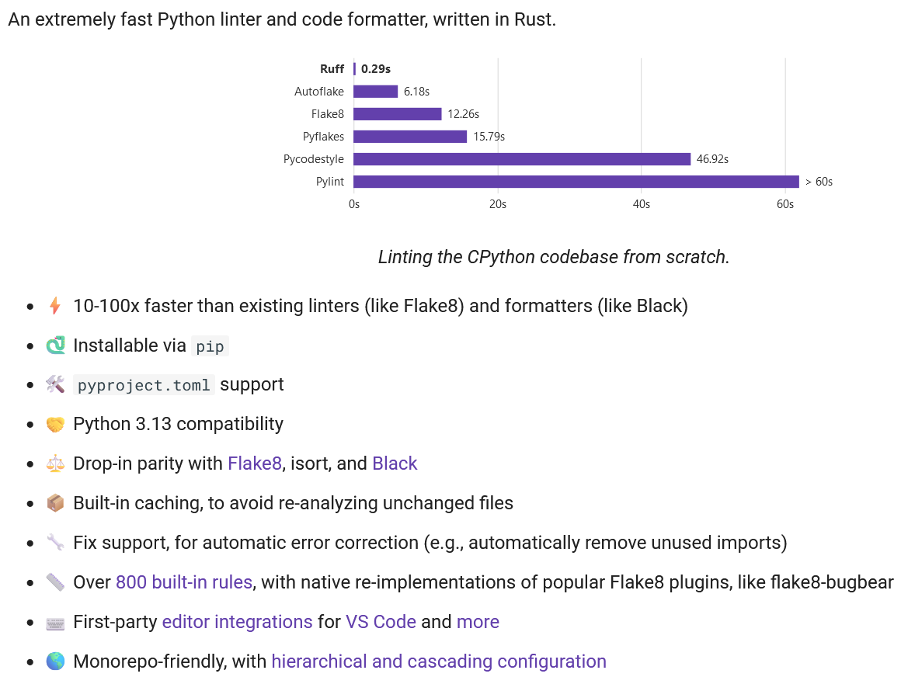

# Préambule

répétition pour Jeudi : Meetup Python
super cool, venez

notes vos remarques constructives, ce qui n'est pas clair, ce qui mérite illustration, ...

redites par rapport à Décembre, mais version + clean

---

# Ecosystème Python fracturé et fragile

![Anna-Lena Popkes - unbiased evaluation of [...] tools](venn_diagram_updated_08_2024.png){ style="height: 700;" }

---

## A la recherche des bonnes pratiques

TODO replay Francoise Conil
TODO lien de ses slides

confondre le problème et la solutions
détails d'implémentation

---

# Astral

objectif : productivité en Python

---

TODO ruff
{ style="height: 700px;" }

---

secret sauce : des gens compétents (expérience, connus de la communauté ...), de l'argent, et shoulders of giants

risque : VC

---

TODO update

Poetry 

PDM 

uv 

---

# uv

TODO rye

---

{ style="height: 700px;" }

---

## Repartir sur de bonnes bases

> * `pyproject.toml` (pas de `.py` ni `.cfg` ni `.txt` ...)
> * PEPs : adopter voire contribuer
> * intégrations : Docker, Jupyter, pre-commit, GitHub Actions, Gitlab CI/CD, ...
> * [python-build-standalone](https://github.com/indygreg/python-build-standalone)
> * pas besoin de bootstrap grâce à Rust

---

## Performance

Rust, network optimisation, caching, ...

---

## Success stories

> * "l'essayer c'est l'adopter"
> * vitesse (exécution, résolution des dépendances, réduction des downloads, caching, ...)
> * ergonomie (options, erreurs claires)
> * automatisation de l'environnement virtual (peu de commandes, reproductif et déclaratif)
> * gestion facile et rapide de la version de Python
> * gestion du tooling (`uv tool ...`)
> * lock file (reproductibilité dans le temps ou entre les personnes)
> * bien meilleur que les autres, et s'améliore encore 😅

---

# Fin : questions ?
